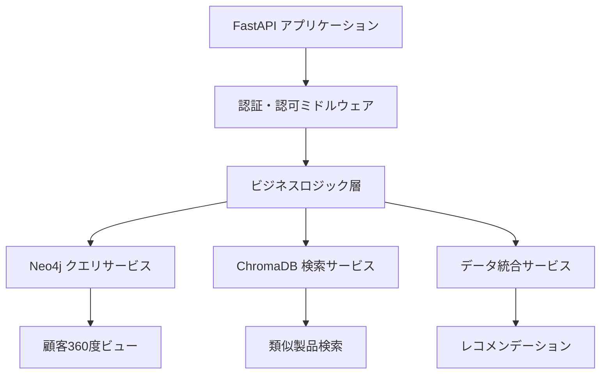

# nvisionプロジェクト Phase 2 詳細実装計画

## 📋 計画概要

**作成日**: 2025年6月2日  
**対象フェーズ**: Phase 2 - API層とクエリエンジン実装  
**推定期間**: 5-6週間  
**実装戦略**: FastAPI基盤優先、CI/CD先行構築  

### Phase 1完了状況
- ✅ データモデル基盤（CRM、EC、共有モデル）完成
- ✅ ChromaDBベクトル検索基盤構築済み
- ✅ 埋め込みサービス実装完了
- ✅ Docker環境安定稼働
- ✅ 基本テストフレームワーク構築済み

### Phase 2目標
**実用的なMVP構築**: API層とクエリエンジンの実装による完全なデータアクセス基盤の確立

## 🎯 実装戦略

### 優先順位
1. **CI/CD基盤構築** - 品質保証の自動化
2. **FastAPI基盤実装** - データアクセス層の構築
3. **認証・認可システム** - セキュリティ基盤の確立
4. **コアAPI実装** - ビジネスロジックの実装
5. **統合・最適化** - パフォーマンス向上
6. **ドキュメント・デプロイ** - 運用準備

### アーキテクチャ概要

## 📝 実装ステップ概要

| ステップ | 期間 | 主要成果物 | 完了条件 |
|----------|------|------------|----------|
| Step 1: CI/CD基盤構築 | 3-4日 | GitHub Actions、品質ゲート | 自動テスト・デプロイ動作 |
| Step 2: FastAPI基盤実装 | 4-5日 | FastAPIアプリ、ミドルウェア | アプリケーション正常起動 |
| Step 3: データアクセス層実装 | 5-6日 | リポジトリ、サービス層 | CRUD操作正常動作 |
| Step 4: 認証・認可システム | 4-5日 | JWT認証、ユーザー管理 | 認証フロー完成 |
| Step 5: コアAPI実装 | 7-8日 | CRUD API、検索API | 全エンドポイント動作 |
| Step 6: 統合・最適化 | 4-5日 | キャッシュ、エラーハンドリング | パフォーマンス基準達成 |
| Step 7: ドキュメント・デプロイ | 3-4日 | API仕様書、運用マニュアル | 本番環境デプロイ成功 |

**総推定期間**: 30-37日（約5-6週間）

## 🔗 関連ドキュメント

- [詳細ステップガイド](PHASE2_STEP_BY_STEP_GUIDE.md) - 各ステップの詳細実装手順
- [テスト戦略](PHASE2_TEST_STRATEGY.md) - テスト計画とGit戦略
- [技術仕様](PHASE2_TECHNICAL_SPECIFICATIONS.md) - 技術的詳細とアーキテクチャ
- [リスク管理計画](PHASE2_RISK_MANAGEMENT.md) - リスク評価と対策

## 📊 成功指標 (KPI)

### 技術指標
- **API応答時間**: 95%のリクエストが500ms以内
- **システム可用性**: 99.5%以上
- **テストカバレッジ**: 85%以上
- **デプロイ成功率**: 95%以上

### 品質指標
- **バグ発生率**: 1件/1000リクエスト以下
- **セキュリティ脆弱性**: 0件
- **コード品質スコア**: A評価以上

## 🚀 次のアクション

1. **即座に開始可能**: Step 1 CI/CD基盤構築
2. **準備事項**: GitHub リポジトリの設定確認
3. **推奨開始日**: 2025年6月3日
4. **完了予定日**: 2025年7月10日

---

**注意**: この計画は実際のテスト結果とPhase 1完了状況に基づいて策定されています。実装中に発見される技術的課題に応じて、適宜調整を行ってください。