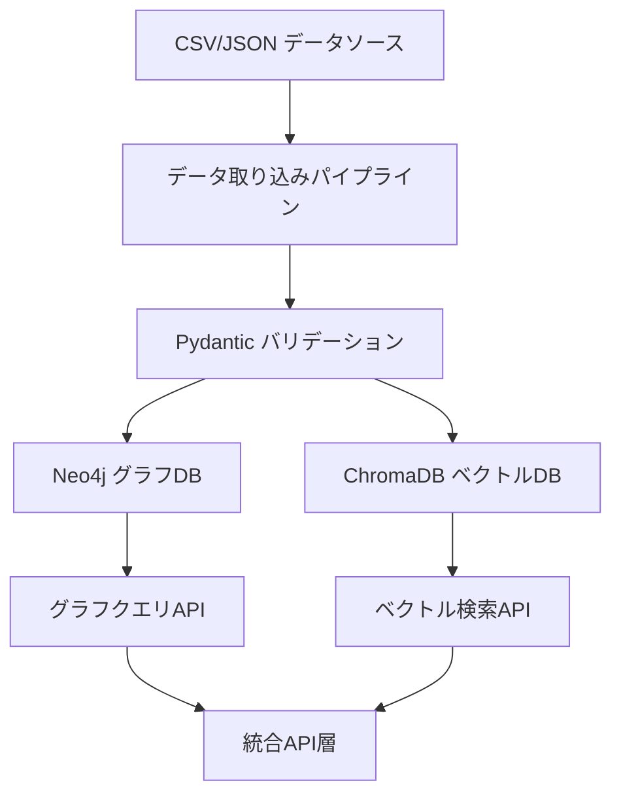
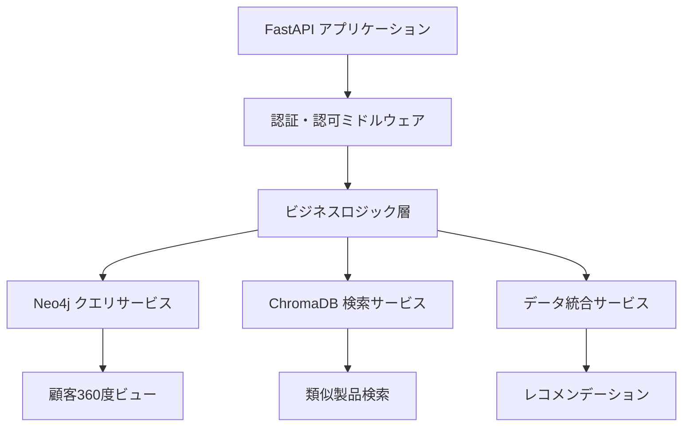
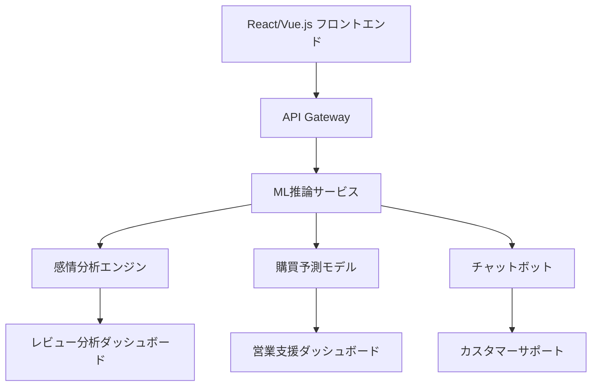
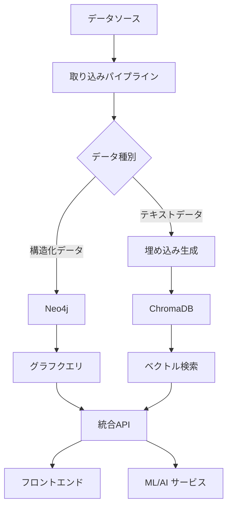

# nvisionプロジェクト開発戦略

## 📊 現状分析

### ✅ 実装済み要素
- **データモデル基盤**: Pydantic v2ベースの包括的なスキーマ定義
- **テストインフラ**: 全モデルの単体・統合テスト完備
- **コンテナ環境**: Docker/docker-compose による開発環境
- **データ取り込み**: CSV形式でのNeo4j連携基盤
- **グラフDB設定**: Neo4j基本スキーマとセットアップ

### 🔍 技術的ギャップ分析
- **ChromaDB統合**: ベクトル埋め込み機能未実装
- **API層**: データアクセス用エンドポイント未開発
- **リアルタイム処理**: イベント駆動アーキテクチャ未構築
- **クロスシステム連携**: EC ↔ CRM データ統合ロジック未実装

## 🎯 MVP定義と段階的実装戦略

### Phase 1: データ基盤強化 (2-3週間)
**目標**: 堅牢なデータ取り込みとベクトル検索基盤の構築

**実装項目**:
1. **ChromaDB統合**
   - ベクトル埋め込み生成パイプライン
   - 製品説明、レビューテキスト、チャットメッセージの埋め込み
   - メタデータ管理とコレクション設計

2. **データ取り込み拡張**
   - CRM・共有システムデータの取り込みスクリプト
   - バッチ処理の最適化とエラーハンドリング強化
   - データ品質チェックとクレンジング機能

3. **Neo4j スキーマ完成**
   - CRM・共有システムのCypherスキーマ実装
   - クロスシステム関係性の定義
   - インデックス最適化

### Phase 2: API層とクエリエンジン (2-3週間)
**目標**: データアクセスとビジネスロジックの実装

**実装項目**:
1. **FastAPI基盤**
   - RESTful API設計とOpenAPI仕様
   - 非同期処理とパフォーマンス最適化
   - 包括的なエラーハンドリング

2. **コアサービス**
   - 顧客行動分析エンジン
   - 製品レコメンデーション機能
   - ベクトル類似度検索
   - グラフトラバーサルクエリ

3. **データ統合ロジック**
   - EC-CRM顧客マッチング
   - クロスシステムインサイト生成
   - リアルタイムデータ同期

### Phase 3: AI/ML機能とフロントエンド (2-3週間)
**目標**: インテリジェント機能とユーザーインターフェース

**実装項目**:
1. **ML/AI機能**
   - 感情分析パイプライン（レビュー・チャット）
   - 購買行動予測モデル
   - 自然言語クエリインターフェース

2. **フロントエンド**
   - 顧客360度ビューダッシュボード
   - リアルタイム分析画面
   - レコメンデーション管理UI

3. **統合とデプロイ**
   - CI/CD パイプライン構築
   - モニタリングとログ集約
   - パフォーマンス最適化

## 🏗️ アーキテクチャ設計

### システム全体構成

### データフロー設計

## 📋 優先順位付き実装計画

### 🚀 短期目標 (1-2週間)
1. **ChromaDB統合** - 最優先
   - Sentence Transformers導入
   - 製品・レビュー埋め込み実装
   - 基本的なベクトル検索API

2. **データ品質向上**
   - CRMデータ取り込み完成
   - データバリデーション強化
   - エラーハンドリング改善

3. **テスト自動化**
   - 統合テスト拡張
   - CI/CD基盤構築
   - コードカバレッジ向上

### 🎯 中期目標 (1-2ヶ月)
1. **API層完成**
   - FastAPI実装
   - 認証・認可システム
   - パフォーマンス最適化

2. **顧客360度ビュー**
   - EC-CRM統合ロジック
   - リアルタイムデータ同期
   - 行動分析エンジン

3. **レコメンデーション機能**
   - 協調フィルタリング
   - コンテンツベースフィルタリング
   - ハイブリッドアプローチ

### 🌟 長期目標 (3-6ヶ月)
1. **AI/ML機能**
   - 感情分析エンジン
   - 購買予測モデル
   - 自然言語インターフェース

2. **スケーラビリティ**
   - マイクロサービス化
   - 負荷分散
   - 分散処理基盤

3. **高度な分析機能**
   - リアルタイムストリーミング
   - 予測分析ダッシュボード
   - A/Bテスト基盤

## ⚠️ リスク評価と対策

### 技術的リスク
| リスク | 影響度 | 対策 |
|--------|--------|------|
| ベクトル検索パフォーマンス | 高 | インデックス最適化、キャッシュ戦略 |
| データ整合性問題 | 中 | トランザクション管理、データバリデーション |
| スケーラビリティ制約 | 中 | 段階的アーキテクチャ改善 |

### 統合リスク
| リスク | 影響度 | 対策 |
|--------|--------|------|
| システム間データ不整合 | 高 | 統一データモデル、同期メカニズム |
| API互換性問題 | 中 | バージョニング戦略、後方互換性 |
| リアルタイム処理遅延 | 中 | 非同期処理、キューイングシステム |

### パフォーマンスリスク
| リスク | 影響度 | 対策 |
|--------|--------|------|
| 大量データ処理遅延 | 高 | バッチ処理最適化、並列処理 |
| ベクトル検索レスポンス遅延 | 中 | インデックス戦略、キャッシュ活用 |
| メモリ使用量増大 | 中 | メモリ効率的なアルゴリズム採用 |

## 🛠️ 具体的なアクションアイテム

### Week 1-2: データ基盤強化
- [ ] ChromaDB Docker設定追加
- [ ] Sentence Transformers統合
- [ ] 製品埋め込みパイプライン実装
- [ ] CRMデータ取り込みスクリプト完成
- [ ] データ品質チェック機能追加

### Week 3-4: API層開発
- [ ] FastAPI プロジェクト構造設計
- [ ] Neo4j/ChromaDB接続サービス実装
- [ ] 基本的なCRUD API開発
- [ ] 認証・認可ミドルウェア実装
- [ ] API ドキュメント自動生成

### Week 5-6: 統合とテスト
- [ ] EC-CRM統合ロジック実装
- [ ] エンドツーエンドテスト作成
- [ ] パフォーマンステスト実施
- [ ] CI/CD パイプライン構築
- [ ] モニタリング設定

### Week 7-8: ML/AI機能
- [ ] 感情分析モデル統合
- [ ] レコメンデーションエンジン実装
- [ ] ベクトル類似度検索最適化
- [ ] 自然言語クエリ機能
- [ ] 予測分析機能

### Week 9-12: フロントエンドとデプロイ
- [ ] React/Vue.js ダッシュボード開発
- [ ] リアルタイム分析画面
- [ ] ユーザー認証・認可UI
- [ ] 本番環境デプロイ
- [ ] パフォーマンス監視設定

## 📈 成功指標 (KPI)

### 技術指標
- **データ処理速度**: 1万件/分以上のデータ取り込み
- **API レスポンス時間**: 95%のリクエストが500ms以内
- **ベクトル検索精度**: Top-10での関連度90%以上
- **システム可用性**: 99.5%以上のアップタイム

### ビジネス指標
- **顧客インサイト精度**: 予測精度80%以上
- **レコメンデーション効果**: クリック率向上20%以上
- **データ統合率**: EC-CRM顧客マッチング率85%以上
- **ユーザー満足度**: ダッシュボード使用率70%以上

## 🔧 技術スタック詳細

### バックエンド
- **Python 3.9+**: メイン開発言語
- **FastAPI**: REST API フレームワーク
- **Pydantic v2**: データバリデーション
- **Neo4j**: グラフデータベース
- **ChromaDB**: ベクトルデータベース
- **Redis**: キャッシュ・セッション管理

### ML/AI
- **Sentence Transformers**: テキスト埋め込み
- **scikit-learn**: 機械学習アルゴリズム
- **spaCy**: 自然言語処理
- **Transformers**: 事前訓練済みモデル

### インフラ・DevOps
- **Docker**: コンテナ化
- **docker-compose**: 開発環境
- **GitHub Actions**: CI/CD
- **pytest**: テストフレームワーク
- **Prometheus + Grafana**: モニタリング

### フロントエンド
- **React/Vue.js**: UI フレームワーク
- **TypeScript**: 型安全な開発
- **Chart.js/D3.js**: データ可視化
- **Material-UI/Vuetify**: UIコンポーネント

## 📚 参考資料とドキュメント

### 既存ドキュメント
- [`data_schema_and_transformation_proposal.md`](-nvision/data_schema_and_transformation_proposal.md): データスキーマ設計
- [`docs/data_ingestion_framework.md`](-nvision/docs/data_ingestion_framework.md): データ取り込みフレームワーク
- [`README.md`](-nvision/README.md): プロジェクト概要

### 追加作成予定ドキュメント
- API設計仕様書
- データベース設計書
- デプロイメントガイド
- 運用・保守マニュアル

## 🎯 次のステップ

1. **Phase 1開始**: ChromaDB統合とデータ基盤強化
2. **チーム体制確立**: 役割分担と開発プロセス定義
3. **開発環境整備**: CI/CD パイプライン構築
4. **定期レビュー**: 週次進捗確認と課題解決

この戦略により、nvisionプロジェクトは段階的かつ確実に顧客行動分析とAI/ML基盤を構築し、3-6ヶ月で実用的なMVPを実現できます。