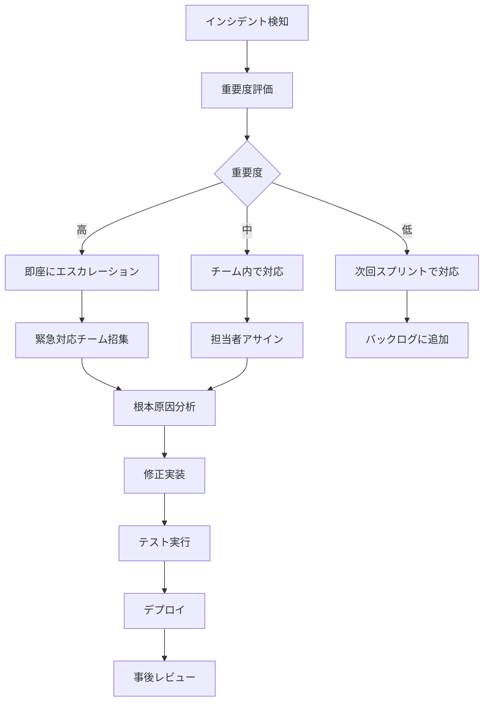

# Phase 2 リスク管理計画

## 🚨 リスク評価マトリックス

### リスク評価基準

| 影響度 | 説明 | スコア |
|--------|------|--------|
| 低 | 軽微な遅延、品質への小さな影響 | 1-2 |
| 中 | 中程度の遅延、機能制限 | 3-4 |
| 高 | 大幅な遅延、重要機能の欠如 | 5 |

| 発生確率 | 説明 | スコア |
|----------|------|--------|
| 低 | 発生する可能性が低い（10%未満） | 1-2 |
| 中 | 発生する可能性がある（10-50%） | 3-4 |
| 高 | 発生する可能性が高い（50%以上） | 5 |

**リスクスコア = 影響度 × 発生確率**

## 📊 特定されたリスクと対策

### 技術的リスク

#### 1. API応答時間遅延
- **リスクスコア**: 4 × 3 = 12 (高リスク)
- **説明**: データベースクエリの複雑化により、API応答時間が目標値（500ms）を超過
- **影響**: ユーザー体験の悪化、システムパフォーマンス低下
- **対策**:
  ```python
  # 1. クエリ最適化
  # Neo4jクエリのインデックス活用
  CREATE INDEX customer_email_index FOR (c:Customer) ON (c.email);
  
  # 2. キャッシュ戦略実装
  @cache_result(ttl=300)
  async def get_customer_data(customer_id: str):
      return await customer_repository.get_by_id(customer_id)
  
  # 3. 非同期処理の活用
  async def parallel_data_fetch(customer_id: str):
      tasks = [
          get_customer_basic_info(customer_id),
          get_customer_orders(customer_id),
          get_customer_reviews(customer_id)
      ]
      return await asyncio.gather(*tasks)
  ```
- **監視指標**: API応答時間、データベースクエリ時間
- **早期警告**: 応答時間が400msを超えた場合にアラート

#### 2. データベース接続エラー
- **リスクスコア**: 5 × 2 = 10 (高リスク)
- **説明**: Neo4j、ChromaDB、Redisへの接続が不安定になる
- **影響**: システム全体の停止、データアクセス不可
- **対策**:
  ```python
  # 1. 接続プール管理
  class ConnectionManager:
      def __init__(self):
          self.neo4j_pool = ConnectionPool(
              uri="bolt://neo4j:7687",
              max_connections=20,
              connection_timeout=30
          )
      
      async def get_connection(self, retries=3):
          for attempt in range(retries):
              try:
                  return await self.neo4j_pool.acquire()
              except ConnectionError:
                  if attempt == retries - 1:
                      raise
                  await asyncio.sleep(2 ** attempt)
  
  # 2. ヘルスチェック機能
  @router.get("/health/detailed")
  async def detailed_health_check():
      health_status = {"status": "healthy", "services": {}}
      
      # Neo4j接続確認
      try:
          await neo4j_client.verify_connectivity()
          health_status["services"]["neo4j"] = "healthy"
      except Exception as e:
          health_status["services"]["neo4j"] = "unhealthy"
          health_status["status"] = "degraded"
      
      return health_status
  
  # 3. サーキットブレーカーパターン
  class CircuitBreaker:
      def __init__(self, failure_threshold=5, timeout=60):
          self.failure_threshold = failure_threshold
          self.timeout = timeout
          self.failure_count = 0
          self.last_failure_time = None
          self.state = "CLOSED"  # CLOSED, OPEN, HALF_OPEN
  ```
- **監視指標**: 接続成功率、接続プール使用率
- **早期警告**: 接続失敗率が5%を超えた場合

#### 3. メモリ使用量増大
- **リスクスコア**: 3 × 4 = 12 (高リスク)
- **説明**: ベクトル埋め込み処理やキャッシュによりメモリ使用量が増大
- **影響**: システムパフォーマンス低下、OOMエラー
- **対策**:
  ```python
  # 1. メモリ効率的な埋め込み処理
  async def process_embeddings_batch(texts: List[str], batch_size: int = 32):
      results = []
      for i in range(0, len(texts), batch_size):
          batch = texts[i:i + batch_size]
          embeddings = await embedding_service.encode(batch)
          results.extend(embeddings)
          
          # メモリ解放
          del embeddings
          gc.collect()
      
      return results
  
  # 2. キャッシュサイズ制限
  redis_client = redis.Redis(
      host='localhost',
      port=6379,
      db=0,
      max_connections=20,
      decode_responses=True
  )
  
  # LRU eviction policy設定
  redis_client.config_set('maxmemory', '1gb')
  redis_client.config_set('maxmemory-policy', 'allkeys-lru')
  
  # 3. メモリ監視
  import psutil
  
  async def monitor_memory_usage():
      memory = psutil.virtual_memory()
      if memory.percent > 80:
          logger.warning(f"High memory usage: {memory.percent}%")
          # キャッシュクリア等の対策実行
  ```
- **監視指標**: メモリ使用率、GCパフォーマンス
- **早期警告**: メモリ使用率が80%を超えた場合

### 統合リスク

#### 4. ChromaDB-Neo4j同期エラー
- **リスクスコア**: 4 × 3 = 12 (高リスク)
- **説明**: ベクトルデータベースとグラフデータベース間のデータ整合性問題
- **影響**: 検索結果の不整合、データの信頼性低下
- **対策**:
  ```python
  # 1. トランザクション管理
  async def create_product_with_embedding(product_data: Product):
      async with database_transaction() as tx:
          try:
              # Neo4jに製品データ保存
              neo4j_result = await tx.neo4j.create_product(product_data)
              
              # 埋め込み生成
              embedding = await embedding_service.encode([product_data.description])
              
              # ChromaDBに埋め込み保存
              chroma_result = await tx.chroma.add_embedding(
                  collection="products",
                  document=product_data.description,
                  embedding=embedding[0],
                  metadata={"product_id": product_data.product_id}
              )
              
              await tx.commit()
              return neo4j_result
              
          except Exception as e:
              await tx.rollback()
              raise
  
  # 2. データ整合性チェック
  async def verify_data_consistency():
      # Neo4jの製品数取得
      neo4j_count = await neo4j_client.execute_query(
          "MATCH (p:Product) RETURN count(p) as count"
      )
      
      # ChromaDBの製品数取得
      chroma_count = chroma_client.count(collection_name="products")
      
      if neo4j_count[0]["count"] != chroma_count:
          logger.error(f"Data inconsistency detected: Neo4j={neo4j_count}, Chroma={chroma_count}")
          # 自動修復処理実行
          await repair_data_inconsistency()
  
  # 3. 定期的な整合性チェック
  @scheduler.scheduled_job('interval', minutes=30)
  async def scheduled_consistency_check():
      await verify_data_consistency()
  ```
- **監視指標**: データ整合性率、同期エラー数
- **早期警告**: データ不整合が検出された場合

#### 5. 認証システム障害
- **リスクスコア**: 5 × 2 = 10 (高リスク)
- **説明**: JWT認証システムの障害によりAPIアクセスが不可能
- **影響**: システム全体へのアクセス不可、業務停止
- **対策**:
  ```python
  # 1. 冗長化された認証サービス
  class AuthService:
      def __init__(self):
          self.primary_auth = JWTAuthenticator()
          self.backup_auth = BackupAuthenticator()
      
      async def authenticate(self, token: str):
          try:
              return await self.primary_auth.verify_token(token)
          except AuthenticationError:
              logger.warning("Primary auth failed, trying backup")
              return await self.backup_auth.verify_token(token)
  
  # 2. 緊急時アクセス機能
  @router.post("/auth/emergency")
  async def emergency_access(emergency_key: str):
      if emergency_key == settings.EMERGENCY_ACCESS_KEY:
          # 限定的なアクセストークン発行
          return generate_emergency_token(permissions=["read:basic"])
      raise HTTPException(status_code=403, detail="Invalid emergency key")
  
  # 3. 認証状態監視
  async def monitor_auth_health():
      try:
          test_token = generate_test_token()
          await auth_service.verify_token(test_token)
          return True
      except Exception as e:
          logger.error(f"Auth system health check failed: {e}")
          # アラート送信
          await send_alert("Authentication system failure detected")
          return False
  ```
- **監視指標**: 認証成功率、トークン検証時間
- **早期警告**: 認証失敗率が10%を超えた場合

### 開発・運用リスク

#### 6. CI/CDパイプライン障害
- **リスクスコア**: 3 × 3 = 9 (中リスク)
- **説明**: GitHub Actionsの障害により自動テスト・デプロイが停止
- **影響**: 開発速度の低下、品質保証プロセスの中断
- **対策**:
  ```yaml
  # 1. 複数環境でのCI実行
  strategy:
    matrix:
      os: [ubuntu-latest, windows-latest]
      python-version: [3.9, 3.10, 3.11]
  
  # 2. フォールバック戦略
  - name: Run tests with fallback
    run: |
      pytest tests/ || {
        echo "Primary test run failed, running with reduced scope"
        pytest tests/unit/ --maxfail=5
      }
  
  # 3. 手動デプロイ手順書
  # docs/MANUAL_DEPLOYMENT.md に詳細手順を記載
  ```
- **監視指標**: CI成功率、ビルド時間
- **早期警告**: CI失敗率が20%を超えた場合

#### 7. 開発チーム間の連携不足
- **リスクスコア**: 2 × 4 = 8 (中リスク)
- **説明**: API設計やデータモデルの認識齟齬により統合時に問題発生
- **影響**: 統合作業の遅延、追加修正作業
- **対策**:
  ```markdown
  # 1. 定期的なレビュー会議
  - 週次進捗レビュー（毎週金曜日）
  - API設計レビュー（各ステップ完了時）
  - コードレビュー（全PR必須）
  
  # 2. ドキュメント管理
  - API仕様書の自動生成・更新
  - データモデル変更の影響分析
  - 変更履歴の詳細記録
  
  # 3. コミュニケーションツール
  - Slack: 日常的なコミュニケーション
  - GitHub Issues: 課題管理
  - Confluence: 設計ドキュメント管理
  ```
- **監視指標**: PR レビュー時間、統合テスト成功率
- **早期警告**: レビュー待ち時間が24時間を超えた場合

## 🔧 リスク軽減戦略

### 予防的対策

#### 1. 包括的なテスト戦略
```python
# 単体テスト
@pytest.mark.unit
def test_customer_repository_create():
    # リポジトリ層の単体テスト
    pass

# 統合テスト
@pytest.mark.integration
async def test_api_database_integration():
    # API-DB統合テスト
    pass

# E2Eテスト
@pytest.mark.e2e
async def test_complete_user_workflow():
    # エンドツーエンドテスト
    pass

# パフォーマンステスト
@pytest.mark.performance
async def test_api_response_time():
    start_time = time.time()
    response = await client.get("/api/v1/customers")
    duration = time.time() - start_time
    assert duration < 0.5  # 500ms以内
```

#### 2. 段階的デプロイメント
```yaml
# Blue-Green デプロイメント
deployment_strategy:
  type: "blue-green"
  steps:
    1. "Deploy to staging environment"
    2. "Run smoke tests"
    3. "Deploy to blue environment"
    4. "Run health checks"
    5. "Switch traffic to blue"
    6. "Monitor for 30 minutes"
    7. "Rollback if issues detected"
```

#### 3. 監視・アラートシステム
```python
# Prometheus メトリクス
from prometheus_client import Counter, Histogram, Gauge

# エラー率監視
ERROR_RATE = Counter('api_errors_total', 'Total API errors', ['endpoint'])

# 応答時間監視
RESPONSE_TIME = Histogram('api_response_time_seconds', 'API response time')

# データベース接続監視
DB_CONNECTIONS = Gauge('database_connections', 'Database connections', ['db_type'])

# アラート設定
alerts:
  - name: "High Error Rate"
    condition: "error_rate > 5%"
    action: "Send Slack notification"
  
  - name: "Slow Response Time"
    condition: "response_time_p95 > 1s"
    action: "Send email to dev team"
  
  - name: "Database Connection Issues"
    condition: "db_connection_failures > 10"
    action: "Page on-call engineer"
```

### 対応的対策

#### 1. インシデント対応プロセス


#### 2. ロールバック戦略
```bash
# 自動ロールバック
#!/bin/bash
HEALTH_CHECK_URL="https://api.nvision.com/health"
ROLLBACK_VERSION="v1.2.3"

# ヘルスチェック実行
if ! curl -f $HEALTH_CHECK_URL; then
    echo "Health check failed, initiating rollback"
    
    # 前バージョンにロールバック
    kubectl rollout undo deployment/nvision-api
    
    # ロールバック確認
    kubectl rollout status deployment/nvision-api
    
    # 通知送信
    slack-notify "🚨 Auto-rollback executed for nvision-api"
fi
```

#### 3. データ復旧手順
```python
# データバックアップ・復旧
class DataRecoveryService:
    async def backup_critical_data(self):
        """重要データのバックアップ"""
        timestamp = datetime.now().isoformat()
        
        # Neo4jデータバックアップ
        neo4j_backup = await self.neo4j_client.export_data()
        await self.save_backup(f"neo4j_backup_{timestamp}.json", neo4j_backup)
        
        # ChromaDBデータバックアップ
        chroma_backup = await self.chroma_client.export_collections()
        await self.save_backup(f"chroma_backup_{timestamp}.json", chroma_backup)
    
    async def restore_from_backup(self, backup_timestamp: str):
        """バックアップからの復旧"""
        # データ整合性チェック
        if not await self.verify_backup_integrity(backup_timestamp):
            raise ValueError("Backup integrity check failed")
        
        # 復旧実行
        await self.restore_neo4j_data(backup_timestamp)
        await self.restore_chroma_data(backup_timestamp)
        
        # 復旧後検証
        await self.verify_data_consistency()
```

## 📋 リスク監視ダッシュボード

### 主要監視指標

| カテゴリ | 指標 | 正常範囲 | 警告閾値 | 危険閾値 |
|----------|------|----------|----------|----------|
| パフォーマンス | API応答時間 | < 200ms | 200-500ms | > 500ms |
| パフォーマンス | スループット | > 500 req/s | 200-500 req/s | < 200 req/s |
| 可用性 | システム稼働率 | > 99.5% | 99-99.5% | < 99% |
| 可用性 | エラー率 | < 1% | 1-5% | > 5% |
| リソース | CPU使用率 | < 70% | 70-85% | > 85% |
| リソース | メモリ使用率 | < 80% | 80-90% | > 90% |
| データベース | 接続プール使用率 | < 70% | 70-85% | > 85% |
| データベース | クエリ応答時間 | < 100ms | 100-500ms | > 500ms |

### アラート設定

#### 即座対応が必要なアラート
- システム稼働率 < 99%
- エラー率 > 5%
- データベース接続失敗
- 認証システム障害

#### 監視が必要なアラート
- API応答時間 > 200ms
- CPU使用率 > 70%
- メモリ使用率 > 80%
- 異常なトラフィック増加

## 🚀 継続的改善プロセス

### 週次リスク評価
```markdown
# 週次リスク評価チェックリスト

## パフォーマンス
- [ ] API応答時間トレンド確認
- [ ] データベースクエリパフォーマンス分析
- [ ] リソース使用率トレンド確認

## 品質
- [ ] テストカバレッジ確認
- [ ] バグ発生率分析
- [ ] コード品質メトリクス確認

## セキュリティ
- [ ] 脆弱性スキャン結果確認
- [ ] 認証ログ分析
- [ ] アクセスパターン異常検知

## 運用
- [ ] デプロイ成功率確認
- [ ] インシデント発生状況分析
- [ ] 監視アラート精度確認
```

### 月次リスク見直し
1. **新規リスクの特定**: 技術変更、要件変更に伴う新しいリスク
2. **既存リスクの再評価**: 発生確率・影響度の見直し
3. **対策の有効性評価**: 実装した対策の効果測定
4. **リスク管理プロセスの改善**: 手順・ツールの最適化

この包括的なリスク管理計画により、Phase 2の実装を安全かつ確実に進めることができます。