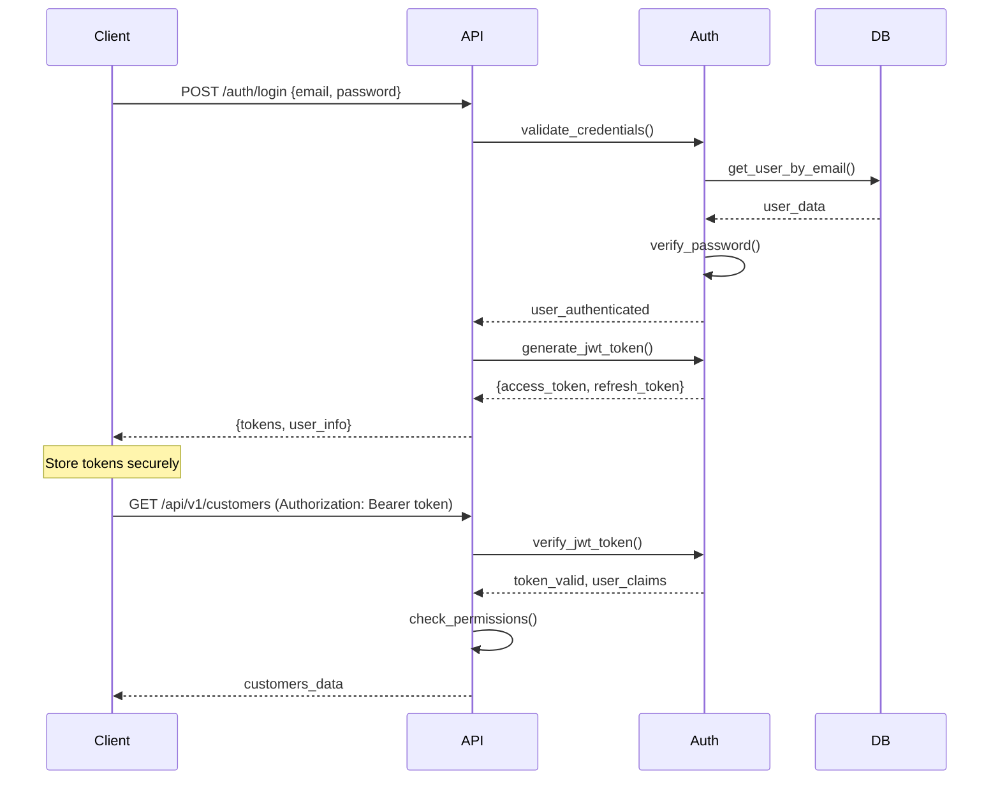
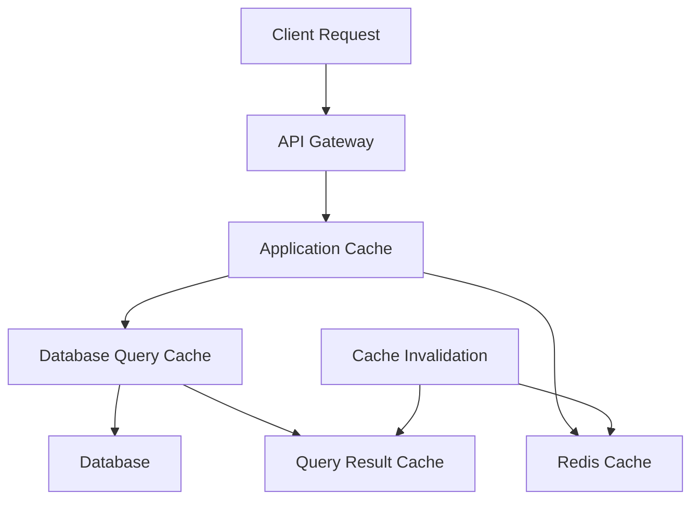

# Phase 2 技術仕様とアーキテクチャ

## 🏗️ システムアーキテクチャ

### 全体アーキテクチャ概要



```mermaid
architecture-beta
    group api(cloud)[API Layer]
    group business(server)[Business Logic Layer]
    group data(database)[Data Layer]
    group external(internet)[External Services]

    service fastapi(logos:fastapi)[FastAPI] in api
    service auth(logos:auth0)[Auth Service] in api
    service gateway(logos:nginx)[API Gateway] in api

    service customer(server)[Customer Service] in business
    service product(server)[Product Service] in business
    service search(server)[Search Service] in business
    service recommend(server)[Recommendation Service] in business

    service neo4j(logos:neo4j)[Neo4j] in data
    service chroma(database)[ChromaDB] in data
    service redis(logos:redis)[Redis Cache] in data

    service embedding(logos:huggingface)[Embedding API] in external
    service monitoring(logos:prometheus)[Monitoring] in external

    fastapi:R --> L:customer
    fastapi:R --> L:product
    fastapi:R --> L:search
    fastapi:R --> L:recommend
    
    customer:R --> L:neo4j
    product:R --> L:neo4j
    search:R --> L:chroma
    recommend:R --> L:chroma
    
    fastapi:B --> T:redis
    search:B --> T:embedding
    recommend:B --> T:embedding
```

### レイヤー別責務

#### API Layer (FastAPI)
- **責務**: HTTP リクエスト/レスポンス処理、認証・認可、入力検証
- **技術**: FastAPI, Pydantic, JWT
- **パフォーマンス目標**: 95%のリクエストが500ms以内

#### Business Logic Layer
- **責務**: ビジネスロジック実装、データ変換、サービス間連携
- **技術**: Python 3.9+, 依存性注入パターン
- **設計原則**: SOLID原則、Clean Architecture

#### Data Layer
- **責務**: データ永続化、クエリ実行、トランザクション管理
- **技術**: Neo4j (グラフDB), ChromaDB (ベクトルDB), Redis (キャッシュ)
- **整合性**: ACID特性、結果整合性

## 🔧 技術スタック詳細

### バックエンド技術

#### Python環境
```yaml
Python Version: 3.9+
Package Manager: pip
Virtual Environment: venv
Dependency Management: requirements.txt
```

#### 主要フレームワーク・ライブラリ
```yaml
Web Framework:
  - FastAPI: 0.104.0+
  - Uvicorn: 0.24.0+
  - Pydantic: 2.5.0+

Database Clients:
  - neo4j: 5.14.0+
  - chromadb: 0.4.15+
  - redis: 5.0.0+

Authentication:
  - python-jose[cryptography]: 3.3.0+
  - passlib[bcrypt]: 1.7.4+
  - python-multipart: 0.0.6+

Testing:
  - pytest: 7.4.0+
  - pytest-asyncio: 0.21.0+
  - pytest-cov: 4.1.0+
  - httpx: 0.25.0+

Code Quality:
  - black: 23.9.0+
  - flake8: 6.1.0+
  - mypy: 1.6.0+
  - isort: 5.12.0+
```

### データベース設計

#### Neo4j グラフデータベース
**用途**: 構造化データ、関係性データの管理

**ノードタイプ**:
```cypher
// 顧客ノード
(:Customer {
  customer_id: String,
  first_name: String,
  last_name: String,
  email: String,
  phone: String,
  created_at: DateTime,
  updated_at: DateTime
})

// 製品ノード
(:Product {
  product_id: String,
  name: String,
  description: String,
  price: Float,
  category_id: String,
  brand_id: String,
  stock_quantity: Integer,
  created_at: DateTime,
  updated_at: DateTime
})

// 注文ノード
(:Order {
  order_id: String,
  customer_id: String,
  order_date: DateTime,
  status: String,
  total_amount: Float,
  created_at: DateTime,
  updated_at: DateTime
})

// カテゴリノード
(:Category {
  category_id: String,
  name: String,
  description: String,
  parent_category_id: String
})

// ブランドノード
(:Brand {
  brand_id: String,
  name: String,
  description: String,
  website: String
})
```

**関係タイプ**:
```cypher
// 顧客-注文関係
(:Customer)-[:PLACED]->(:Order)

// 注文-製品関係
(:Order)-[:CONTAINS {quantity: Integer, unit_price: Float}]->(:Product)

// 製品-カテゴリ関係
(:Product)-[:BELONGS_TO]->(:Category)

// 製品-ブランド関係
(:Product)-[:MANUFACTURED_BY]->(:Brand)

// カテゴリ階層関係
(:Category)-[:PARENT_OF]->(:Category)

// 顧客-製品関係（購入履歴）
(:Customer)-[:PURCHASED {purchase_date: DateTime, quantity: Integer}]->(:Product)

// レビュー関係
(:Customer)-[:REVIEWED {rating: Integer, comment: String, review_date: DateTime}]->(:Product)
```

**インデックス設計**:
```cypher
// 主キーインデックス
CREATE CONSTRAINT customer_id_unique FOR (c:Customer) REQUIRE c.customer_id IS UNIQUE;
CREATE CONSTRAINT product_id_unique FOR (p:Product) REQUIRE p.product_id IS UNIQUE;
CREATE CONSTRAINT order_id_unique FOR (o:Order) REQUIRE o.order_id IS UNIQUE;

// 検索用インデックス
CREATE INDEX customer_email_index FOR (c:Customer) ON (c.email);
CREATE INDEX product_name_index FOR (p:Product) ON (p.name);
CREATE INDEX order_date_index FOR (o:Order) ON (o.order_date);

// 複合インデックス
CREATE INDEX customer_name_index FOR (c:Customer) ON (c.first_name, c.last_name);
CREATE INDEX product_category_index FOR (p:Product) ON (p.category_id, p.brand_id);
```

#### ChromaDB ベクトルデータベース
**用途**: テキスト埋め込み、類似度検索、レコメンデーション

**コレクション設計**:
```python
# 製品コレクション
products_collection = {
    "name": "products",
    "metadata": {
        "description": "Product descriptions and features",
        "embedding_model": "sentence-transformers/all-MiniLM-L6-v2",
        "dimension": 384
    },
    "documents": [
        # 製品説明文、特徴、仕様
    ],
    "embeddings": [
        # 384次元ベクトル
    ],
    "metadatas": [
        {
            "product_id": "string",
            "category": "string",
            "brand": "string",
            "price": "float",
            "stock": "integer"
        }
    ]
}

# レビューコレクション
reviews_collection = {
    "name": "reviews",
    "metadata": {
        "description": "Customer reviews and feedback",
        "embedding_model": "sentence-transformers/all-MiniLM-L6-v2",
        "dimension": 384
    },
    "documents": [
        # レビューテキスト
    ],
    "embeddings": [
        # 384次元ベクトル
    ],
    "metadatas": [
        {
            "review_id": "string",
            "product_id": "string",
            "customer_id": "string",
            "rating": "integer",
            "sentiment": "string"
        }
    ]
}

# CRMノートコレクション
crm_notes_collection = {
    "name": "crm_notes",
    "metadata": {
        "description": "Customer interaction notes",
        "embedding_model": "sentence-transformers/all-MiniLM-L6-v2",
        "dimension": 384
    },
    "documents": [
        # 顧客対応記録、メモ
    ],
    "embeddings": [
        # 384次元ベクトル
    ],
    "metadatas": [
        {
            "note_id": "string",
            "customer_id": "string",
            "interaction_type": "string",
            "timestamp": "datetime",
            "agent_id": "string"
        }
    ]
}
```

#### Redis キャッシュ
**用途**: セッション管理、クエリ結果キャッシュ、レート制限

**キー設計**:
```redis
# セッション管理
session:{user_id}:{session_id} -> {user_data}
TTL: 1800 seconds (30分)

# クエリ結果キャッシュ
query:customers:{hash} -> {query_result}
TTL: 300 seconds (5分)

query:products:{hash} -> {query_result}
TTL: 600 seconds (10分)

# ベクトル検索結果キャッシュ
vector_search:{query_hash} -> {search_results}
TTL: 1800 seconds (30分)

# レート制限
rate_limit:{user_id}:{endpoint} -> {request_count}
TTL: 3600 seconds (1時間)

# 統計情報キャッシュ
stats:daily:{date} -> {daily_stats}
TTL: 86400 seconds (24時間)
```

## 🔐 セキュリティ設計

### 認証・認可システム

#### JWT認証フロー


#### 権限管理システム
```python
# 権限レベル定義
class Permission(Enum):
    READ_CUSTOMERS = "read:customers"
    WRITE_CUSTOMERS = "write:customers"
    READ_PRODUCTS = "read:products"
    WRITE_PRODUCTS = "write:products"
    READ_ORDERS = "read:orders"
    WRITE_ORDERS = "write:orders"
    ADMIN_ACCESS = "admin:access"

# ロール定義
ROLES = {
    "viewer": [
        Permission.READ_CUSTOMERS,
        Permission.READ_PRODUCTS,
        Permission.READ_ORDERS
    ],
    "editor": [
        Permission.READ_CUSTOMERS,
        Permission.WRITE_CUSTOMERS,
        Permission.READ_PRODUCTS,
        Permission.WRITE_PRODUCTS,
        Permission.READ_ORDERS
    ],
    "admin": [
        Permission.READ_CUSTOMERS,
        Permission.WRITE_CUSTOMERS,
        Permission.READ_PRODUCTS,
        Permission.WRITE_PRODUCTS,
        Permission.READ_ORDERS,
        Permission.WRITE_ORDERS,
        Permission.ADMIN_ACCESS
    ]
}
```

#### セキュリティ対策
```python
# パスワードハッシュ化
from passlib.context import CryptContext

pwd_context = CryptContext(schemes=["bcrypt"], deprecated="auto")

def hash_password(password: str) -> str:
    return pwd_context.hash(password)

def verify_password(plain_password: str, hashed_password: str) -> bool:
    return pwd_context.verify(plain_password, hashed_password)

# JWT設定
JWT_SETTINGS = {
    "algorithm": "HS256",
    "access_token_expire_minutes": 30,
    "refresh_token_expire_days": 7,
    "secret_key": "your-secret-key-here"  # 環境変数から取得
}

# レート制限
RATE_LIMITS = {
    "auth": "5/minute",      # 認証エンドポイント
    "api": "100/minute",     # 一般APIエンドポイント
    "search": "50/minute",   # 検索エンドポイント
    "upload": "10/minute"    # アップロードエンドポイント
}
```

## 📊 API設計仕様

### RESTful API設計原則

#### エンドポイント命名規則
```
GET    /api/v1/customers           # 顧客一覧取得
POST   /api/v1/customers           # 顧客作成
GET    /api/v1/customers/{id}      # 特定顧客取得
PUT    /api/v1/customers/{id}      # 顧客更新
DELETE /api/v1/customers/{id}      # 顧客削除

GET    /api/v1/products            # 製品一覧取得
POST   /api/v1/products            # 製品作成
GET    /api/v1/products/{id}       # 特定製品取得
PUT    /api/v1/products/{id}       # 製品更新
DELETE /api/v1/products/{id}       # 製品削除

GET    /api/v1/orders              # 注文一覧取得
POST   /api/v1/orders              # 注文作成
GET    /api/v1/orders/{id}         # 特定注文取得
PUT    /api/v1/orders/{id}         # 注文更新

# 検索・フィルタリング
GET    /api/v1/search/customers    # 顧客検索
GET    /api/v1/search/products     # 製品検索
POST   /api/v1/search/vector       # ベクトル検索

# レコメンデーション
GET    /api/v1/recommendations/products/{customer_id}  # 製品推薦
GET    /api/v1/recommendations/customers/{product_id}  # 類似顧客
```

#### レスポンス形式標準化
```json
// 成功レスポンス
{
  "success": true,
  "data": {
    // 実際のデータ
  },
  "meta": {
    "total": 100,
    "page": 1,
    "per_page": 20,
    "total_pages": 5
  },
  "timestamp": "2025-06-02T23:15:00Z"
}

// エラーレスポンス
{
  "success": false,
  "error": {
    "code": "VALIDATION_ERROR",
    "message": "Invalid input data",
    "details": [
      {
        "field": "email",
        "message": "Invalid email format"
      }
    ]
  },
  "timestamp": "2025-06-02T23:15:00Z"
}
```

#### ページネーション設計
```python
class PaginationParams(BaseModel):
    page: int = Field(default=1, ge=1, description="Page number")
    per_page: int = Field(default=20, ge=1, le=100, description="Items per page")
    sort_by: Optional[str] = Field(default=None, description="Sort field")
    sort_order: Optional[str] = Field(default="asc", regex="^(asc|desc)$")

class PaginatedResponse(BaseModel, Generic[T]):
    success: bool = True
    data: List[T]
    meta: PaginationMeta
    timestamp: datetime

class PaginationMeta(BaseModel):
    total: int
    page: int
    per_page: int
    total_pages: int
    has_next: bool
    has_prev: bool
```

### API エンドポイント詳細仕様

#### 顧客管理API
```python
# GET /api/v1/customers
@router.get("/customers", response_model=PaginatedResponse[CustomerResponse])
async def list_customers(
    pagination: PaginationParams = Depends(),
    search: Optional[str] = Query(None, description="Search term"),
    email_filter: Optional[str] = Query(None, description="Email filter"),
    created_after: Optional[datetime] = Query(None, description="Created after date"),
    current_user: User = Depends(get_current_user)
):
    """
    顧客一覧取得
    
    - **search**: 名前、メールでの部分一致検索
    - **email_filter**: メールアドレスでのフィルタリング
    - **created_after**: 指定日時以降に作成された顧客のみ
    """

# POST /api/v1/customers
@router.post("/customers", response_model=CustomerResponse, status_code=201)
async def create_customer(
    customer_data: CustomerCreateRequest,
    current_user: User = Depends(get_current_user)
):
    """
    新規顧客作成
    
    - **customer_data**: 顧客情報（名前、メール、電話番号等）
    """

# GET /api/v1/customers/{customer_id}
@router.get("/customers/{customer_id}", response_model=CustomerDetailResponse)
async def get_customer(
    customer_id: str,
    include_orders: bool = Query(False, description="Include order history"),
    include_reviews: bool = Query(False, description="Include review history"),
    current_user: User = Depends(get_current_user)
):
    """
    特定顧客の詳細情報取得
    
    - **customer_id**: 顧客ID
    - **include_orders**: 注文履歴を含める
    - **include_reviews**: レビュー履歴を含める
    """
```

#### 製品管理API
```python
# GET /api/v1/products
@router.get("/products", response_model=PaginatedResponse[ProductResponse])
async def list_products(
    pagination: PaginationParams = Depends(),
    category_id: Optional[str] = Query(None, description="Category filter"),
    brand_id: Optional[str] = Query(None, description="Brand filter"),
    min_price: Optional[float] = Query(None, ge=0, description="Minimum price"),
    max_price: Optional[float] = Query(None, ge=0, description="Maximum price"),
    in_stock: Optional[bool] = Query(None, description="In stock filter"),
    current_user: User = Depends(get_current_user)
):
    """
    製品一覧取得
    
    - **category_id**: カテゴリでのフィルタリング
    - **brand_id**: ブランドでのフィルタリング
    - **min_price/max_price**: 価格範囲でのフィルタリング
    - **in_stock**: 在庫有無でのフィルタリング
    """

# POST /api/v1/search/vector
@router.post("/search/vector", response_model=VectorSearchResponse)
async def vector_search(
    search_request: VectorSearchRequest,
    current_user: User = Depends(get_current_user)
):
    """
    ベクトル類似度検索
    
    - **query**: 検索クエリテキスト
    - **collection**: 検索対象コレクション（products, reviews, crm_notes）
    - **limit**: 結果件数制限
    - **threshold**: 類似度閾値
    """
```

## ⚡ パフォーマンス設計

### パフォーマンス目標

| 指標 | 目標値 | 測定方法 |
|------|--------|----------|
| API応答時間 | 95%が500ms以内 | APM監視 |
| データベースクエリ | 平均100ms以内 | クエリログ分析 |
| ベクトル検索 | 平均200ms以内 | 専用メトリクス |
| スループット | 1000 req/sec | 負荷テスト |
| 可用性 | 99.5%以上 | アップタイム監視 |

### キャッシュ戦略

#### 多層キャッシュアーキテクチャ


#### キャッシュ実装
```python
from functools import wraps
import redis
import json
import hashlib

redis_client = redis.Redis(host='localhost', port=6379, db=0)

def cache_result(ttl: int = 300):
    """結果キャッシュデコレータ"""
    def decorator(func):
        @wraps(func)
        async def wrapper(*args, **kwargs):
            # キャッシュキー生成
            cache_key = f"{func.__name__}:{hashlib.md5(str(args + tuple(kwargs.items())).encode()).hexdigest()}"
            
            # キャッシュから取得試行
            cached_result = redis_client.get(cache_key)
            if cached_result:
                return json.loads(cached_result)
            
            # 関数実行
            result = await func(*args, **kwargs)
            
            # 結果をキャッシュに保存
            redis_client.setex(cache_key, ttl, json.dumps(result, default=str))
            
            return result
        return wrapper
    return decorator

# 使用例
@cache_result(ttl=600)  # 10分間キャッシュ
async def get_customer_orders(customer_id: str):
    """顧客の注文履歴取得（キャッシュ付き）"""
    return await customer_service.get_orders(customer_id)
```

### データベース最適化

#### Neo4j クエリ最適化
```cypher
// インデックス活用クエリ
MATCH (c:Customer {email: $email})
RETURN c

// 複合インデックス活用
MATCH (p:Product)
WHERE p.category_id = $category_id AND p.brand_id = $brand_id
RETURN p

// 関係性を活用した効率的なクエリ
MATCH (c:Customer)-[:PURCHASED]->(p:Product)<-[:PURCHASED]-(similar:Customer)
WHERE c.customer_id = $customer_id
RETURN similar, count(p) as common_products
ORDER BY common_products DESC
LIMIT 10
```

#### ChromaDB 検索最適化
```python
# バッチ埋め込み生成
async def generate_embeddings_batch(texts: List[str]) -> List[List[float]]:
    """バッチでの埋め込み生成（効率化）"""
    return embedding_service.encode(texts, batch_size=32)

# 効率的な類似度検索
async def similarity_search_optimized(
    query: str,
    collection_name: str,
    limit: int = 10,
    threshold: float = 0.7
) -> List[Dict]:
    """最適化された類似度検索"""
    query_embedding = await embedding_service.encode([query])
    
    results = chroma_client.query(
        collection_name=collection_name,
        query_embeddings=query_embedding,
        n_results=limit,
        where={"score": {"$gte": threshold}}
    )
    
    return results
```

## 🔍 監視・ログ設計

### ログ設計

#### 構造化ログ形式
```python
import structlog
import logging

# ログ設定
logging.basicConfig(
    format="%(message)s",
    stream=sys.stdout,
    level=logging.INFO,
)

structlog.configure(
    processors=[
        structlog.stdlib.filter_by_level,
        structlog.stdlib.add_logger_name,
        structlog.stdlib.add_log_level,
        structlog.stdlib.PositionalArgumentsFormatter(),
        structlog.processors.TimeStamper(fmt="iso"),
        structlog.processors.StackInfoRenderer(),
        structlog.processors.format_exc_info,
        structlog.processors.UnicodeDecoder(),
        structlog.processors.JSONRenderer()
    ],
    context_class=dict,
    logger_factory=structlog.stdlib.LoggerFactory(),
    wrapper_class=structlog.stdlib.BoundLogger,
    cache_logger_on_first_use=True,
)

logger = structlog.get_logger()

# 使用例
logger.info(
    "API request processed",
    endpoint="/api/v1/customers",
    method="GET",
    user_id="user123",
    response_time=0.245,
    status_code=200
)
```

#### メトリクス収集
```python
from prometheus_client import Counter, Histogram, Gauge

# メトリクス定義
REQUEST_COUNT = Counter(
    'api_requests_total',
    'Total API requests',
    ['method', 'endpoint', 'status']
)

REQUEST_DURATION = Histogram(
    'api_request_duration_seconds',
    'API request duration',
    ['method', 'endpoint']
)

ACTIVE_CONNECTIONS = Gauge(
    'database_connections_active',
    'Active database connections',
    ['database']
)

# メトリクス記録
@app.middleware("http")
async def metrics_middleware(request: Request, call_next):
    start_time = time.time()
    
    response = await call_next(request)
    
    duration = time.time() - start_time
    REQUEST_DURATION.labels(
        method=request.method,
        endpoint=request.url.path
    ).observe(duration)
    
    REQUEST_COUNT.labels(
        method=request.method,
        endpoint=request.url.path,
        status=response.status_code
    ).inc()
    
    return response
```

この技術仕様書により、Phase 2の実装において一貫性のある高品質なシステムを構築できます。